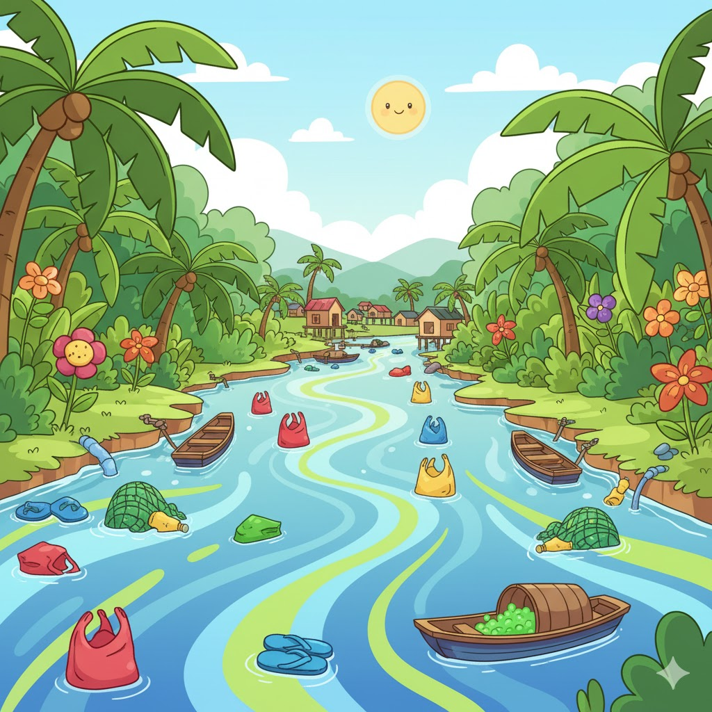

# 🌊 EcoMatch VN - Plastic Pollution Memory Game



## 📖 Overview

**EcoMatch VN** is an educational memory card game focused on plastic pollution in Vietnam. Players match causes of plastic pollution with their corresponding solutions while learning important facts about the impact of plastic waste on Vietnam's environment.

## 🎮 Gameplay

### Collection of Mini-Games

EcoMatch VN features 2 interactive mini-games:

1. **🎮 Card Matching** - Memory card game matching causes with solutions
2. **🗂️ Cause Sorter** - Drag-and-drop categorization game

### How to Play

#### Card Matching
1. **Start Game** - Click "🎮 Card Matching" button from main menu
2. **Flip Cards** - Click on 2 cards to flip and reveal images
3. **Match Pairs** - Match causes with appropriate solutions:
   - 🛍️ Single-use plastics ➡️ ♻️ Reusable bags
   - 🗑️ Littering ➡️ 🧹 Clean-up campaigns
   - 🌊 Ocean pollution ➡️ ♻️ Recycling
   - 🏭 Plastic production ➡️ 📜 Government bans
4. **Learn** - After each correct match, read educational facts about plastic pollution in Vietnam
5. **Complete** - Match all 4 pairs to win the game!

#### Cause Sorter
1. **Start** - Click "🗂️ Cause Sorter" button
2. **Drag & Drop** - Drag 8 items into 3 categories:
   - 🏠 **Daily Life** - Plastic bags, water bottles, straws
   - 🏭 **Industrial** - Industrial packaging, factory waste
   - 📋 **Poor Management** - Unsorted waste, lack of collection
3. **Categorize** - Drop items in correct zones to score (+20 per item)
4. **Complete** - Sort all 8 items correctly

### Scoring

- **Card Matching**: ✅ +100 points per correct match | ❌ -10 points per wrong match | ⏱️ Time bonus
- **Cause Sorter**: ✅ +20 points per correct item (maximum 160 points)
- 💾 **Shared Scoring** - Scores saved in localStorage and accumulated across mini-games

## 🎯 Educational Goals

This game aims to:
- 🌍 Raise awareness about plastic pollution in Vietnam
- 📚 Educate about causes and solutions
- 💡 Encourage environmental protection actions
- 🎓 Provide real statistics about plastic waste situation

## 🛠️ Technology Stack

### Frontend
- **HTML5** - 6-page architecture (index, play, sorter, instructions, about, results)
- **CSS3** - Advanced styling with animations, responsive design, backdrop filters, drag-drop UI
- **JavaScript (Vanilla)** - 850+ lines: game logic, localStorage management
- **Bootstrap 5.3.2** - Responsive grid system and utilities

### Features
- 🌐 **Bilingual Support** - EN/VI language toggle with localStorage persistence
- 🎨 **Modern UI/UX** - Gradient backgrounds, glass-morphism effects, smooth animations
- 📱 **Fully Responsive** - Mobile-first design (320px+), tablet, desktop optimized
- 🎮 **Interactive Elements** - Pill-style language toggle, card flip, drag-drop, modal popups
- 🗂️ **HTML5 Drag API** - Native drag-and-drop mechanics for Cause Sorter
- 💾 **Persistent Storage** - Game progress and scores saved via localStorage
- 🔒 **No Backend Required** - 100% client-side, runs in any browser

### Assets
- **Custom Illustrations** - AI-generated with Gemini Nano/Banana
- **Background Image** - Custom ocean/nature theme with gradient overlay
- **Card Designs** - 8 unique cards (4 causes + 4 solutions)

### No Installation Required
The game runs entirely in a web browser, no backend or database needed.

## 🚀 How to Run

### Method 1: Direct Open (Recommended)

1. Download or clone this repository
2. Open `game_app/index.html` file in a web browser (Chrome, Firefox, Safari, Edge)
3. Start playing immediately!

```bash
# Clone repository
git clone https://github.com/TuHaPhuc/RMIT-Hackathon2025-ZipLine.git

# Navigate to folder
cd RMIT-Hackathon2025-ZipLine/game_submission/game_app

# Open index.html in browser
# Windows: start index.html
# Mac: open index.html
# Linux: xdg-open index.html
```

### Method 2: Using Local Server

```bash
# Using Python
python -m http.server 8000

# Or using Node.js
npx http-server

# Then open browser and navigate to:
# http://localhost:8000
```

## 📁 Project Structure

```
game_submission/
├── game_app/
│   ├── index.html              # Main menu page
│   ├── play.html               # Card matching game
│   ├── sorter.html             # Cause sorter drag-drop game
│   ├── instructions.html       # How to play page
│   ├── about.html              # About the game page
│   ├── results.html            # Game results page
│   ├── style.css               # Complete styling (1100+ lines)
│   ├── script.js               # Game logic (850+ lines)
│   └── assets/                 # Game assets (10 images)
│       ├── Background.png      # Ocean/nature background
│       ├── Card_back.png       # Card back design
│       ├── Cause-cards-single-use-plastic.png
│       ├── Cause-cards-littering.png
│       ├── Cause-cards-fishing-nets.png
│       ├── Cause-cards-industrial-waste.png
│       ├── Solution-cards-reusable-bags.png
│       ├── Solution-cards-clean-up-campaigns.png
│       ├── Solution-cards-recycling.png
│       └── Solution-cards-government-bans.png
├── prompts/
│   ├── concept_prompts.txt                # Game concept & ideation (Grok)
│   ├── asset_generation_prompts.txt       # Image generation (Gemini Nano/Banana)
│   ├── code_generation_prompts.txt        # Code implementation (ChatGPT-4)
│   └── refinement_prompts.txt             # Bug fixes & improvements (Claude)
├── screenshots/
│   ├── menu_screen.png         # Main menu screenshot
│   ├── play_screen1.png        # Card matching gameplay
│   ├── play_screen2.png        # Match found modal
│   ├── play_screen3.png        # Sorter drag-drop
│   └── results_screen.png      # Game completion
├── README.md                   # This file
├── project_report.md           # Detailed project report (Markdown)
├── project_report.pdf          # PDF version of report
└── youtube_link.txt            # Link to demo video
```

## 🎨 Game Features

### ✨ Animations & Visual Effects
- 🔄 Smooth 3D card flip animations (transform: rotateY)
- ✅ Match success animations with green glow
- ❌ Mismatch shake animations
- 🎯 Responsive design for mobile, tablet & desktop
- 🎨 Green color scheme theme - symbol of environment
- 🌊 Background image with gradient overlay
- ✨ Glass-morphism effects (backdrop-filter: blur)
- 💫 Hover effects and transitions

### 🌐 Multi-Language Support
- 🇬🇧 English / 🇻🇳 Vietnamese
- 🎛️ Modern pill-style language toggle (green gradient)
- 💾 Language preference saved in localStorage
- 📝 Full translations for all UI elements and educational content

### 📱 Responsive Design
- 📱 Mobile (320px+): 2-column card grid
- 📱 Tablet (768px+): 4-column card grid
- 💻 Desktop (1024px+): Optimized layout with max-width 900px
- 🎮 Touch and mouse support
- 📐 Flexible card sizing (max 160px on desktop, responsive on mobile)

### 🎯 Game Mechanics
- ⏱️ Live timer tracking play time
- 📊 Dynamic scoring system (+100 match, -10 wrong)
- 🎓 Educational modal popups after each match
- 🔄 Reset button to replay (fully functional)
- 💾 Results saved to localStorage
- 🎮 Visual feedback for every action

## 📊 Educational Content

The game provides 4 important facts about plastic pollution in Vietnam:

1. **Waste Statistics**: 1.8 million tons per year, only 27% recycled
2. **Plastic Bags**: 40 billion bags per year, takes 400-1000 years to decompose
3. **Recycling Benefits**: Saves energy and resources
4. **Marine Life Impact**: 100,000 marine animals die annually

## 🎥 Demo & Screenshots

- 📺 Video demo: [Link in youtube_link.txt]
- 🖼️ Screenshots: See `screenshots/` folder

## 👨‍💻 Development Process

The game was developed through these phases:

1. **Concept Development** - Brainstorming ideas about plastic pollution
2. **Asset Generation** - Creating images with AI tools
3. **Code Implementation** - Building game logic
4. **Testing & Refinement** - Testing and optimization
5. **Documentation** - Writing docs and reports

## 🌟 Key Learning Outcomes

After playing the game, players will:
- ✅ Better understand plastic pollution situation in Vietnam
- ✅ Recognize main causes
- ✅ Know practical solutions that can be applied
- ✅ Have motivation to change plastic consumption behavior

## 🤝 Contributing

This is a project for RMIT Hackathon 2025. If you want to contribute:
- 🐛 Report bugs via GitHub Issues
- 💡 Suggest features or improvements
- 🎨 Contribute assets or educational content

## 📝 License

This project was created for educational purposes in RMIT Hackathon 2025.

## 📧 Contact

- **GitHub**: [TuHaPhuc](https://github.com/TuHaPhuc)
- **Repository**: [RMIT-Hackathon2025-ZipLine](https://github.com/TuHaPhuc/RMIT-Hackathon2025-ZipLine)

## 🙏 Acknowledgments

- RMIT University Vietnam - Hackathon 2025
- AI Tools: Grok (xAI), Gemini Nano/Banana, ChatGPT-4, Claude (for asset generation and code assistance)
- Plastic pollution data sources: Vietnam Environment Administration, UN Environment Programme

---

**🌱 Let's protect our environment together!**
